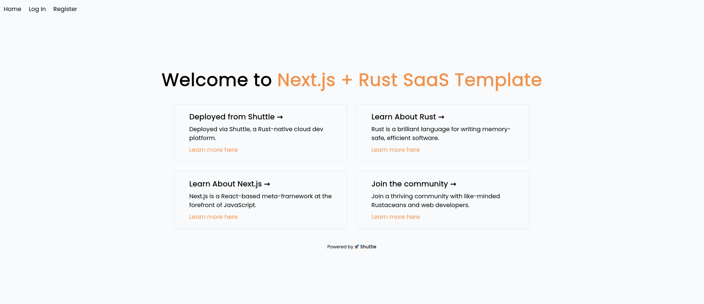

# Shuttle SaaS Example

## Introduction

This template is a SaaS template with a Next.js Typescript frontend and a Rust backend.
The design of the template internally is based on a sales-oriented Customer Relationship Management (CRM) tool where
users will be able to view their customers, sales records as well as some analytics.

## Features

- Take subscription payments with Stripe
- Email session-based login
- Mailgun (email subscription, welcome email etc)
- Pre-configured frontend routes for easy transition
- Examples of how to implement simple dashboard analytics

## Pre-requisites

- Rust
- Node.js/NPM.
- Typescript.
- [cargo-shuttle](https://www.shuttle.rs)

## Instructions for Usage

- Initialize the template with:

    ```sh
    cargo shuttle init --from shuttle-hq/shuttle-examples --subfolder fullstack-templates/saas
    ```

- cd into the folder
- Run `npm i` to install the dependencies on the frontend.
- Set your secrets in the Secrets.toml file at the `Cargo.toml` level of your backend folder. Unset secrets will default
  to "None" to prevent automatic crashing of the web service, but some services may not work.

## Development Scripts

- **Using `dev` for Development:**
    - Run `npm run dev` to start your application with live reload capabilities. This script uses `turbowatch` to
      monitor changes in both the frontend and backend.
    - Visit [http://localhost:8000](http://localhost:8000) once the app has built.
    - If you prefer using `cargo-watch` instead of `turbowatch`, the watch feature can be disabled in
      the `turbowatch.ts` file.
- **Frontend-Focused Development with `next-dev`:**
    - For a frontend-specific development workflow, use `npm run next-dev`.
    - This script runs Next.js in a development mode optimized for faster builds and reloads, enhancing your frontend
      development experience.
- **Analyzing Bundle Size with `analyze`:**
    - The `analyze` script is designed to provide insights into the bundle size of your Next.js application.
    - Run `npm run analyze` to generate a detailed report of the size of each component and dependency in your bundle.
    - This is particularly useful for identifying large dependencies or components that could be optimized for better
      performance.



## Troubleshooting

- If you change the migrations after running locally or deploying, you will need to go into the database itself and
  delete the tables. You can do this easily with something
  like [psql](https://www.postgresql.org/docs/current/app-psql.html) or [pgAdmin](https://www.pgadmin.org/).
- If connecting to external services like Stripe doesn't work, try checking your Secrets.toml file.
- Shuttle connects by default to port 8000 - if you're currently already using something at port 8000, you can add
  the `--port <port-number>` to the `cargo shuttle run` command to change this.
